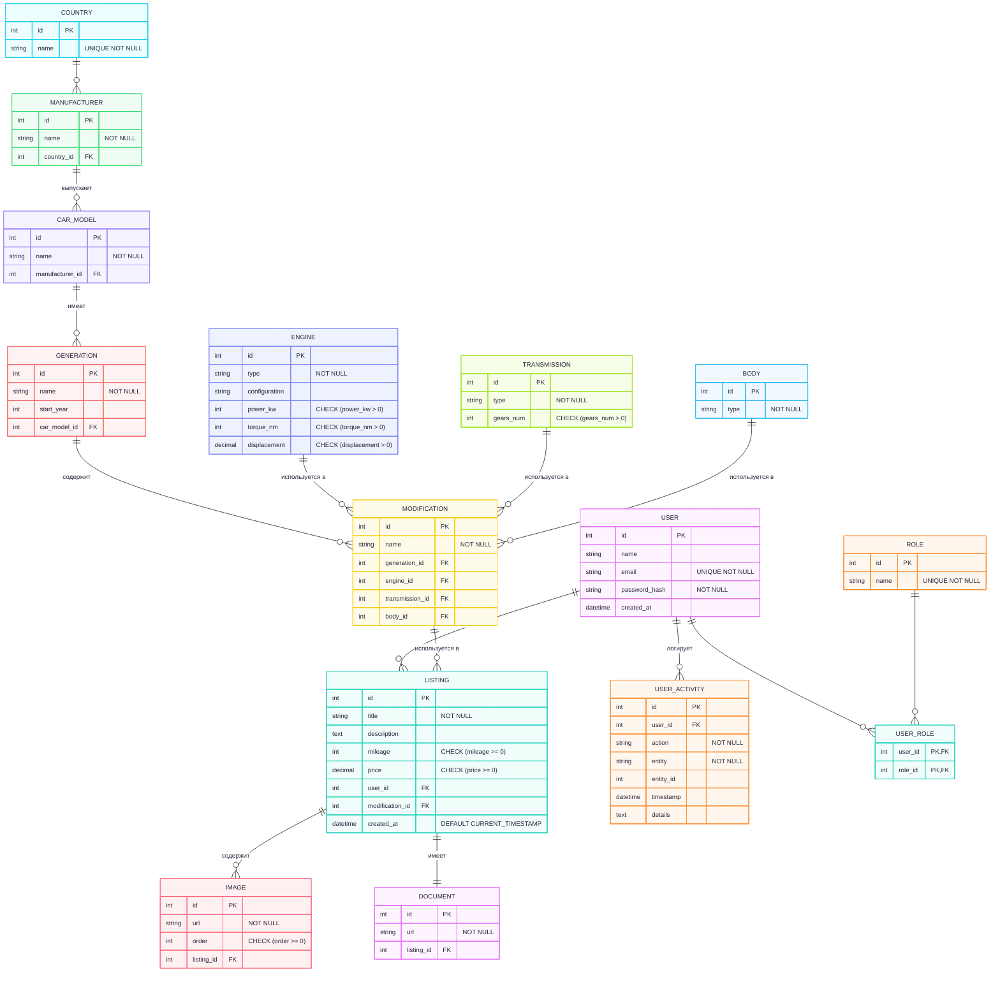

# МДиСУБД ФЕДОТОВ 353501

## Автомобильный маркетплейс

### Функциональные требования:

Базовые:
- Авторизация и аутентификация
- Роли (админ, менеджер, клиента и т.д.)
- Журналирование действий пользователя

Специфичные
- Гибкая настройка информации об автомоблях (функционал каталога):
  - Администрация может добавлять новые конфигурации автомобилей
- Простое размещение объявлений, выбрав конфигурацию автомобиля из каталога
  - Загрузка изображений и файлов (Документов) об автомобиле

## Текстовое описание сущностей

- USER – пользователи системы (администраторы, менеджеры, клиенты). Хранятся основные данные (имя, e-mail, пароль).
- ROLE – роли пользователей (например, admin, manager, client).
- USER_ROLE – таблица связей "многие-ко-многим" между пользователями и ролями.
- LISTING – объявления о продаже автомобиля. Содержат заголовок, описание, пробег, цену, информацию о модификации автомобиля.
- IMAGE – изображения автомобиля, прикрепленные к объявлению. Хранят URL и порядок отображения.
- DOCUMENT – документы, прикрепленные к объявлению (например, ПТС, страховка).
- COUNTRY – страны, в которых расположены производители.
- MANUFACTURER – производители автомобилей (например, BMW, Toyota). Привязаны к стране.
- CAR_MODEL – модель автомобиля (например, Camry, 3 Series). Привязана к производителю.
- GENERATION – поколение модели (например, Camry XV70). Имеет годы выпуска.
- MODIFICATION – конкретная модификация автомобиля (комбинация двигателя, коробки передач и кузова).
- ENGINE – характеристики двигателя (тип, конфигурация, мощность, крутящий момент, объем).
- TRANSMISSION – характеристики трансмиссии (тип, количество передач).
- BODY – тип кузова (седан, хэтчбек и т. д.).
- USER_ACTIVITY – журнал действий пользователей (какое действие, над какой сущностью, когда и с деталями).

