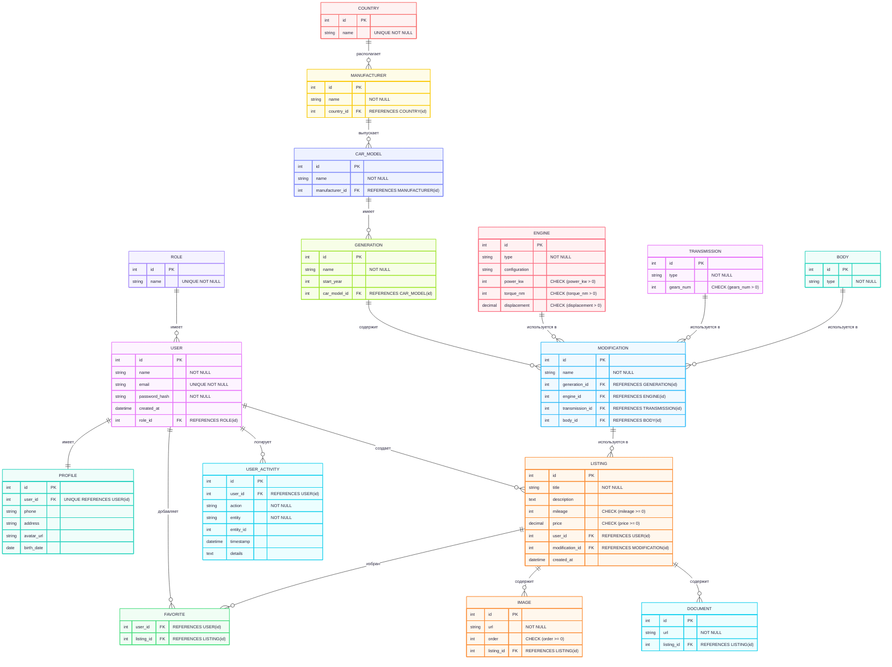

# МДиСУБД

ФИО: Федотов Владислав Андреевич
Группа: 353501
Тема проекта: Автомобильный маркетплейс

## Функциональные требования

### 1. Авторизация и аутентификация

1.1. Регистрация пользователей с уникальным e-mail.
1.2. Вход в систему по e-mail и паролю.
1.3. Хранение пароля в зашифрованном виде (hash + salt).

---

### 2. Роли пользователей

2.1. Поддержка базовых ролей:

* **Admin** – управление пользователями, ролями, каталогом автомобилей, объявлениями.
* **Manager** – модерация объявлений, работа с клиентами.
* **Client** – размещение и просмотр объявлений.

2.2. Назначение одной роли каждому пользователю.
2.3. Ограничение доступа к операциям в зависимости от роли (RBAC).

---

### 3. Журналирование действий пользователя

3.1. Логирование действий (создание/изменение/удаление сущностей, вход в систему, ошибки).
3.2. Запись информации:

* ID пользователя,
* действие,
* сущность,
* идентификатор сущности,
* дата и время,
* дополнительные детали.

3.3. Просмотр истории действий администратором.

---

### 4. Управление каталогом автомобилей (гибкая настройка)

4.1. **Страны** – CRUD для списка стран.
4.2. **Производители** – CRUD производителей с привязкой к странам.
4.3. **Модели** – CRUD моделей, связанных с производителями.
4.4. **Поколения** – CRUD поколений моделей.
4.5. **Модификации** – CRUD конфигураций (связка поколение + двигатель + трансмиссия + кузов).
4.6. **Двигатели, трансмиссии, кузова** – CRUD справочников технических характеристик.
4.7. Администратор может добавлять новые конфигурации автомобилей для использования клиентами.

---

### 5. Размещение объявлений

5.1. Создание объявления:

* выбор модификации автомобиля из каталога,
* указание цены, пробега, описания,
* прикрепление изображений и документов.

5.2. CRUD для объявлений:
* **Create** – размещение нового объявления пользователем,
* **Read** – просмотр объявлений (список + детальная страница),
* **Update** – изменение данных своего объявления,
* **Delete** – удаление объявления.

5.3. Ограничение: удалять и изменять объявления может только автор или администратор.

---

### 6. Загрузка файлов

6.1. **Изображения**:

* возможность прикреплять несколько изображений к одному объявлению,
* задание порядка отображения.

6.2. **Документы**:
* загрузка файлов (ПТС, страховка),
* хранение в привязке к объявлению.

---

### 7. CRUD для всех сущностей

7.1. **Пользователи** – администратор может создавать, изменять и удалять пользователей.
7.2. **Роли** – администратор управляет ролями.
7.3. **Каталог автомобилей** (страны, производители, модели, поколения, модификации, двигатели, трансмиссии, кузова).
7.4. **Объявления, изображения, документы**.
7.5. **Журнал действий** – только просмотр (CRUD ограничен).

---

# Подробное описание сущностей

### USER (Пользователь)

| Поле           | Тип      | Ограничения      | Описание          |
| -------------- | -------- | ---------------- | ----------------- |
| id             | int      | PK               | Уникальный ID     |
| name           | string   | NOT NULL         | Имя               |
| email          | string   | UNIQUE, NOT NULL | Почта (логин)     |
| password\_hash | string   | NOT NULL         | Пароль (хэш)      |
| created\_at    | datetime |                  | Дата регистрации  |
| role\_id       | int      | FK → ROLE(id)    | Роль пользователя |

**Связи**:

* 1:1 с **PROFILE**.
* 1\:M с **LISTING**.
* 1\:M с **USER\_ACTIVITY**.
* M\:N с **LISTING** через **FAVORITE**.
* M:1 с **ROLE**.

---

## PROFILE (Профиль пользователя)

| Поле        | Тип    | Ограничения           | Описание                         |
| ----------- | ------ | --------------------- | -------------------------------- |
| id          | int    | PK                    | Уникальный идентификатор профиля |
| user\_id    | int    | FK, UNIQUE → USER(id) | Ссылка на пользователя           |
| phone       | string |                       | Телефон                          |
| address     | string |                       | Адрес                            |
| avatar\_url | string |                       | Ссылка на аватар                 |
| birth\_date | date   |                       | Дата рождения                    |

**Связи**:

* 1:1 с **USER** (каждый пользователь имеет один профиль).

---

## ROLE (Роль)

| Поле | Тип    | Ограничения      | Описание           |
| ---- | ------ | ---------------- | ------------------ |
| id   | int    | PK               | Уникальный ID роли |
| name | string | UNIQUE, NOT NULL | Название роли      |

**Связи:**

* 1\:M с **USER**

---

## LISTING (Объявление)

| Поле             | Тип      | Ограничения           | Описание               |
| ---------------- | -------- | --------------------- | ---------------------- |
| id               | int      | PK                    | Уникальный ID          |
| title            | string   | NOT NULL              | Заголовок              |
| description      | text     |                       | Описание               |
| mileage          | int      | CHECK (mileage ≥ 0)   | Пробег                 |
| price            | decimal  | CHECK (price ≥ 0)     | Цена                   |
| user\_id         | int      | FK → USER(id)         | Автор объявления       |
| modification\_id | int      | FK → MODIFICATION(id) | Модификация автомобиля |
| created\_at      | datetime |                       | Дата создания          |

**Связи**:

* M:1 с **USER**.
* M:1 с **MODIFICATION**.
* 1\:M с **IMAGE**.
* 1\:M с **DOCUMENT**.
* M\:N с **USER** через **FAVORITE**.

---

## IMAGE (Изображение)

| Поле        | Тип    | Ограничения     | Описание                  |
| ----------- | ------ | --------------- | ------------------------- |
| id          | int    | PK              | Уникальный ID изображения |
| url         | string | NOT NULL        | Путь к файлу              |
| order       | int    | CHECK (≥ 0)     | Порядок отображения       |
| listing\_id | int    | FK → LISTING.id | Объявление                |

**Связи:**

* M:1 с **LISTING**

---

## DOCUMENT (Документ)

| Поле        | Тип    | Ограничения     | Описание                |
| ----------- | ------ | --------------- | ----------------------- |
| id          | int    | PK              | Уникальный ID документа |
| url         | string | NOT NULL        | Путь к файлу            |
| listing\_id | int    | FK → LISTING.id | Объявление              |

**Связи:**

* M:1 с **LISTING**

---

## FAVORITE (Избранное)

| Поле        | Тип | Ограничения          | Описание                             |
| ----------- | --- | -------------------- | ------------------------------------ |
| user\_id    | int | PK, FK → USER(id)    | Пользователь, добавивший в избранное |
| listing\_id | int | PK, FK → LISTING(id) | Объявление, которое в избранном      |

**Связи**:

* M\:N между **USER** и **LISTING**.

---

## COUNTRY (Страна)

| Поле | Тип    | Ограничения      | Описание             |
| ---- | ------ | ---------------- | -------------------- |
| id   | int    | PK               | Уникальный ID страны |
| name | string | UNIQUE, NOT NULL | Название страны      |

**Связи:**

* 1\:M с **MANUFACTURER**

---

## MANUFACTURER (Производитель)

| Поле        | Тип    | Ограничения     | Описание                    |
| ----------- | ------ | --------------- | --------------------------- |
| id          | int    | PK              | Уникальный ID производителя |
| name        | string | NOT NULL        | Название                    |
| country\_id | int    | FK → COUNTRY.id | Страна                      |

**Связи:**

* M:1 с **COUNTRY**
* 1\:M с **CAR\_MODEL**

---

## CAR\_MODEL (Модель)

| Поле             | Тип    | Ограничения          | Описание             |
| ---------------- | ------ | -------------------- | -------------------- |
| id               | int    | PK                   | Уникальный ID модели |
| name             | string | NOT NULL             | Название модели      |
| manufacturer\_id | int    | FK → MANUFACTURER.id | Производитель        |

**Связи:**

* M:1 с **MANUFACTURER**
* 1\:M с **GENERATION**

---

## GENERATION (Поколение)

| Поле           | Тип    | Ограничения        | Описание                |
| -------------- | ------ | ------------------ | ----------------------- |
| id             | int    | PK                 | Уникальный ID поколения |
| name           | string | NOT NULL           | Название поколения      |
| start\_year    | int    |                    | Год начала выпуска      |
| car\_model\_id | int    | FK → CAR\_MODEL.id | Модель                  |

**Связи:**

* M:1 с **CAR\_MODEL**
* 1\:M с **MODIFICATION**

---

## MODIFICATION (Модификация)

| Поле             | Тип    | Ограничения          | Описание                  |
| ---------------- | ------ | -------------------- | ------------------------- |
| id               | int    | PK                   | Уникальный ID модификации |
| name             | string | NOT NULL             | Название модификации      |
| generation\_id   | int    | FK → GENERATION.id   | Поколение                 |
| engine\_id       | int    | FK → ENGINE.id       | Двигатель                 |
| transmission\_id | int    | FK → TRANSMISSION.id | Трансмиссия               |
| body\_id         | int    | FK → BODY.id         | Кузов                     |

**Связи:**

* M:1 с **GENERATION**
* M:1 с **ENGINE**
* M:1 с **TRANSMISSION**
* M:1 с **BODY**
* 1\:M с **LISTING**

---

## ENGINE (Двигатель)

| Поле          | Тип     | Ограничения | Описание                 |
| ------------- | ------- | ----------- | ------------------------ |
| id            | int     | PK          | Уникальный ID двигателя  |
| type          | string  | NOT NULL    | Тип двигателя            |
| configuration | string  |             | Конфигурация (рядный, V) |
| power\_kw     | int     | CHECK (> 0) | Мощность (кВт)           |
| torque\_nm    | int     | CHECK (> 0) | Крутящий момент (Н·м)    |
| displacement  | decimal | CHECK (> 0) | Рабочий объем            |

**Связи:**

* 1\:M с **MODIFICATION**

---

## TRANSMISSION (Трансмиссия)

| Поле       | Тип    | Ограничения | Описание                  |
| ---------- | ------ | ----------- | ------------------------- |
| id         | int    | PK          | Уникальный ID трансмиссии |
| type       | string | NOT NULL    | Тип (АКПП, МКПП, CVT)     |
| gears\_num | int    | CHECK (> 0) | Количество передач        |

**Связи:**

* 1\:M с **MODIFICATION**

---

## BODY (Кузов)

| Поле | Тип    | Ограничения | Описание                  |
| ---- | ------ | ----------- | ------------------------- |
| id   | int    | PK          | Уникальный ID кузова      |
| type | string | NOT NULL    | Тип кузова (седан и т.д.) |

**Связи:**

* 1\:M с **MODIFICATION**

---

## USER\_ACTIVITY (Активность пользователя)

| Поле       | Тип      | Ограничения  | Описание               |
| ---------- | -------- | ------------ | ---------------------- |
| id         | int      | PK           | Уникальный ID записи   |
| user\_id   | int      | FK → USER.id | Пользователь           |
| action     | string   | NOT NULL     | Тип действия           |
| entity     | string   | NOT NULL     | Сущность               |
| entity\_id | int      |              | Идентификатор сущности |
| timestamp  | datetime |              | Время действия         |
| details    | text     |              | Доп. сведения          |

**Связи:**

* M:1 с **USER**

---

## Диаграмма

