# МДиСУБД ФЕДОТОВ 353501

## Автомобильный маркетплейс

### Функциональные требования:

Базовые:
- Авторизация и аутентификация
- Роли (админ, менеджер, клиента и т.д.)
- Журналирование действий пользователя

Специфичные
- Гибкая настройка информации об автомоблях (функционал каталога):
  - Администрация может добавлять новые конфигурации автомобилей
- Простое размещение объявлений, выбрав конфигурацию автомобиля из каталога
  - Загрузка изображений и файлов (Документов) об автомобиле

```mermaid
---
config:
  theme: redux-color
  layout: dagre
---
erDiagram
    USER ||--o{ LISTING : "создает"
    USER ||--o{ USER_ACTIVITY : "логирует"
    MODIFICATION ||--o{ LISTING : "используется в"
    LISTING ||--o{ IMAGE : "содержит"
    LISTING ||--|| DOCUMENT : "имеет"
    COUNTRY || -- o{ MANUFACTURER : ""
    MANUFACTURER ||--o{ CAR_MODEL : "выпускает"
    CAR_MODEL ||--o{ GENERATION : "имеет"
    GENERATION ||--o{ MODIFICATION : "содержит"
    ENGINE ||--o{ MODIFICATION : "используется в"
    TRANSMISSION ||--o{ MODIFICATION : "используется в"
    BODY ||--o{ MODIFICATION : "используется в"
    USER ||--o{ USER_ROLE : ""
    ROLE ||--o{ USER_ROLE : ""
USER {
    int id PK
    string name
    string email "UNIQUE"
    string password_hash
    datetime created_at
}
ROLE {
    int id PK
    string name "UNIQUE"
}
USER_ROLE {
    int user_id FK
    int role_id FK
}
LISTING {
    int id PK
    string title
    text description
    int mileage
    decimal price
    int user_id FK
    int modification_id FK
    datetime created_at
}
IMAGE {
    int id PK
    string url
    int order
    int listing_id FK
}
DOCUMENT {
    int id PK
    string url
    int listing_id FK
}
COUNTRY {
    int id PK
    string name
}
MANUFACTURER {
    int id PK
    string name
    int country_id FK 
}
CAR_MODEL {
    int id PK
    string name
    int manufacturer_id FK
}
GENERATION {
    int id PK
    string name
    int start_year
    int car_model_id FK
}
MODIFICATION {
    int id PK
    string name
    int generation_id FK
    int engine_id FK
    int transmission_id FK
    int body_id FK
}
ENGINE {
    int id PK
    string type
    string configuration
    int power_kw
    int torque_nm
    decimal displacement
}
TRANSMISSION {
    int id PK
    string type
    string gears_num
}
BODY {
    int id PK
    string type
}
USER_ACTIVITY {
    int id PK
    int user_id FK
    string action
    string entity
    int entity_id
    datetime timestamp
    text details
}

```

